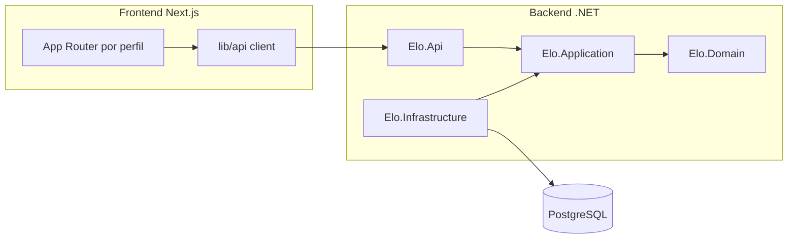

# Arquitetura — Sistema Elo

## Visão geral

Monorepo com backend em **Clean Architecture** e frontend **Next.js**, comunicando via **REST versionada** (`/api/v1/...`).

## Camadas backend

| Projeto | Responsabilidade |
|---------|------------------|
| `Elo.Domain` | Entidades, enums, regras de domínio |
| `Elo.Application` | Casos de uso, DTOs, FluentValidation |
| `Elo.Infrastructure` | EF Core, e-mail, integrações |
| `Elo.Api` | Controllers, middleware, auth, CORS |

## Modelo de dados

- **Paciente** — prontuário, histórico clínico
- **Internacao** — enfermaria, UTI, sepse, óbito
- **SolicitacaoExame** — carimbo, ID amostra, status
- **FormularioClinico** — sintomas, IBP, antimicrobianos, VM
- **ResultadoLaboratorial** — teste rápido, toxina, cepa
- **TratamentoCdiff** — medicação, resposta, recidiva
- **AuditoriaLog** — trilha imutável de alterações
- **Usuario** — RBAC (Médico, Lab, CCIH, Enfermagem, Admin)

## Fluxo principal

1. Médico cadastra/busca paciente e preenche formulário clínico
2. Sistema gera `IdAmostraUnico` e envia para fila do laboratório
3. Laboratório confirma recebimento e lança resultado
4. Resultado **positivo** → alerta CCIH + médico + enfermagem (isolamento)
5. Resultado **negativo** → libera isolamento
6. Pesquisa registra tratamento e desfecho para análises

## Segurança (não negociável)

- JWT ou identidade hospitalar (Azure AD)
- RBAC por perfil
- HTTPS em produção
- Auditoria de alterações em dados clínicos
- CORS restrito ao domínio do frontend

## Comunicação API

- OpenAPI gerado pelo .NET
- Tipos TypeScript: `openapi-typescript` ou NSwag (futuro)
- Validação: FluentValidation (.NET) + Zod (frontend)
